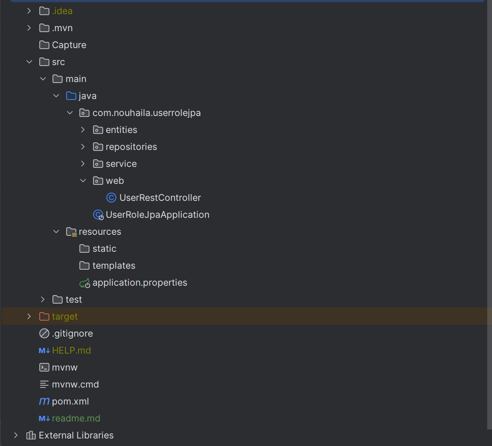
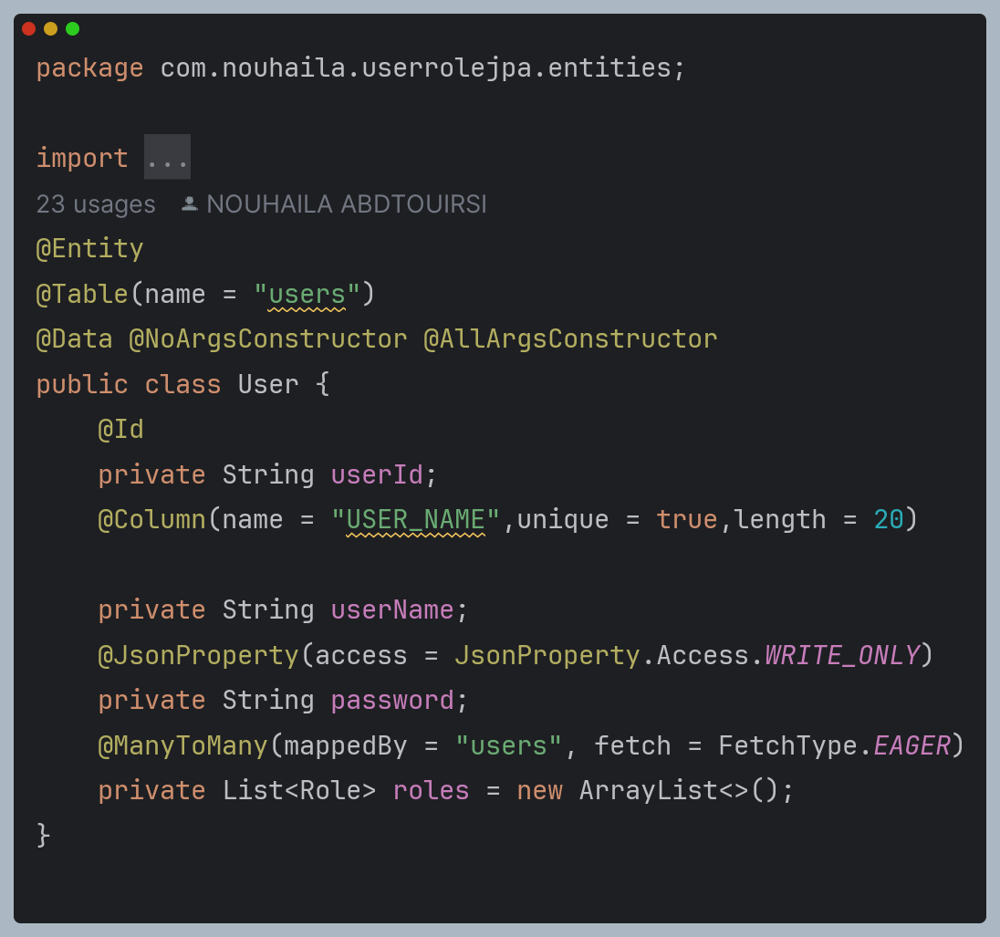
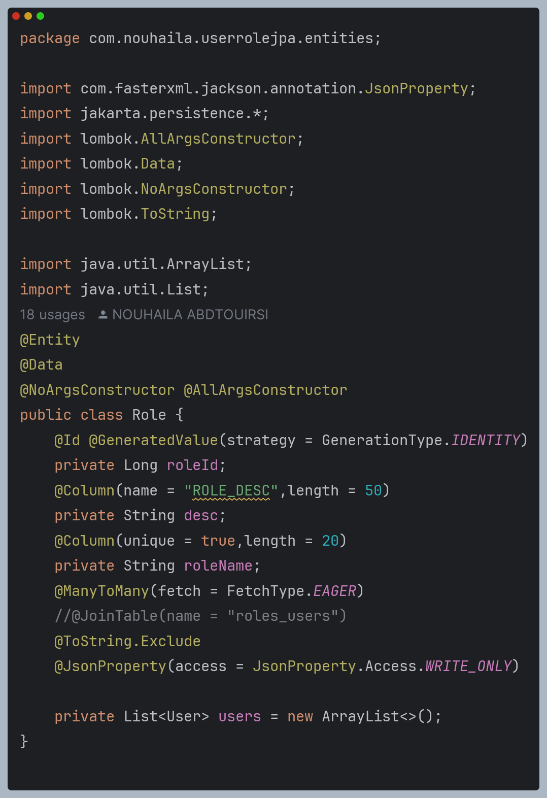
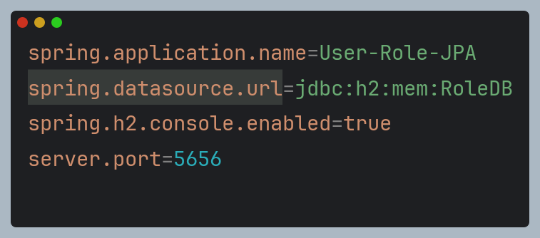
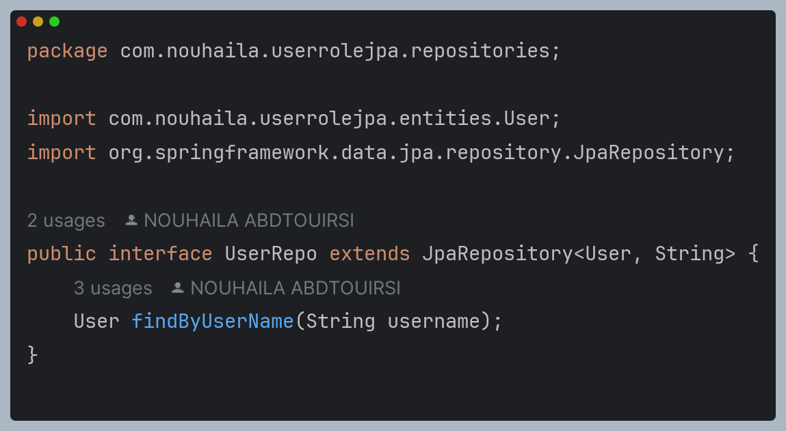
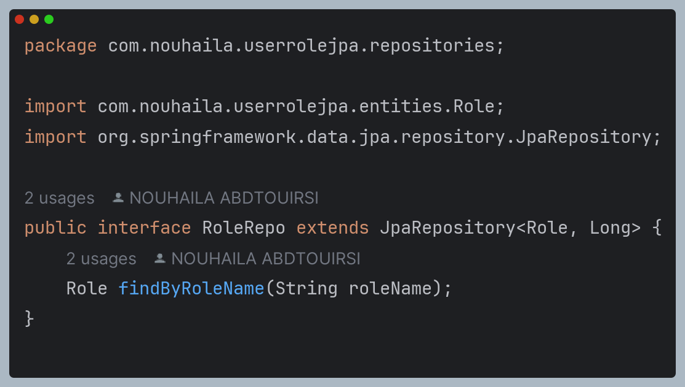
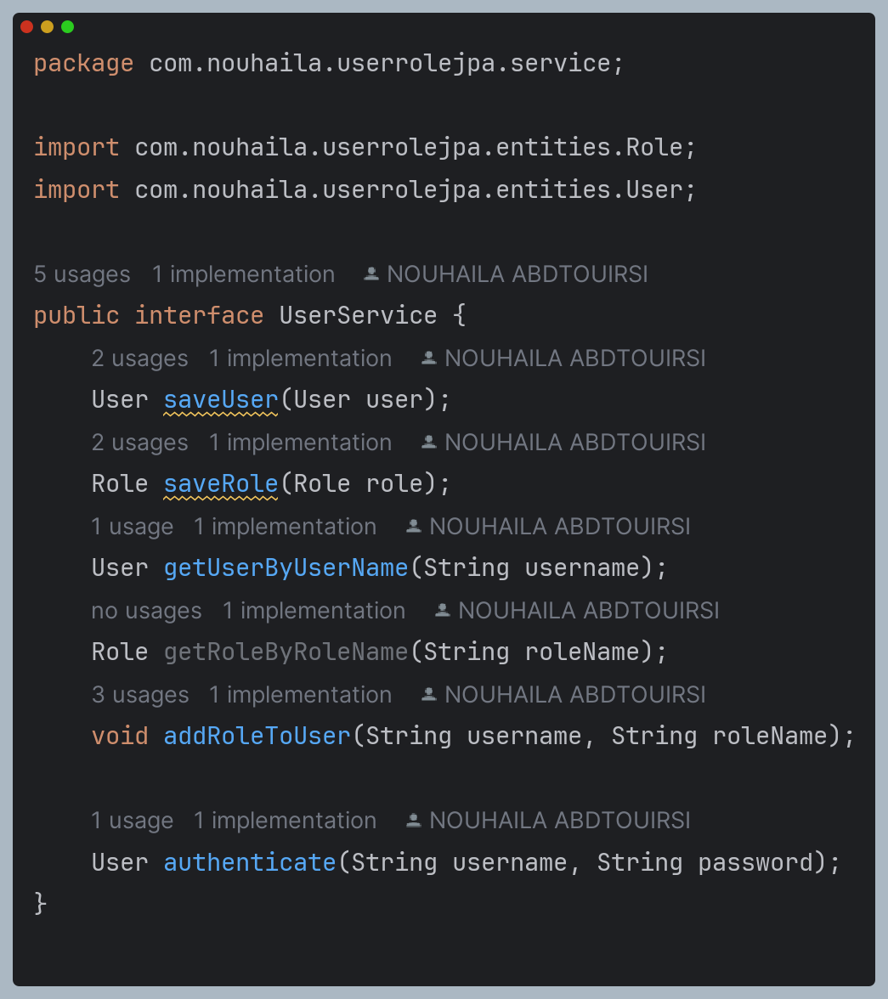
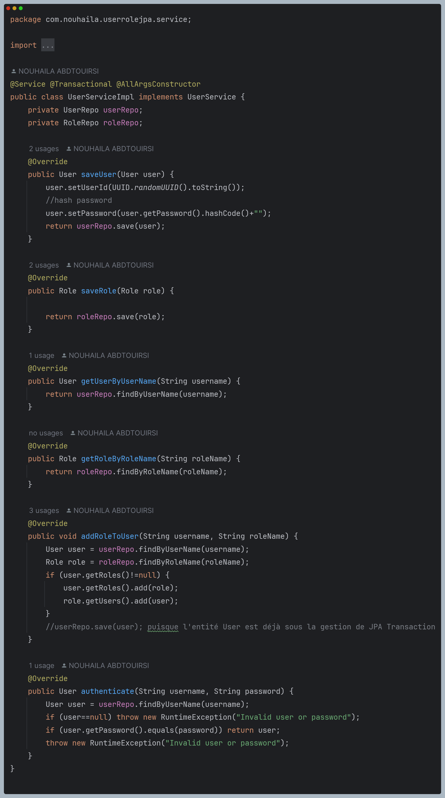
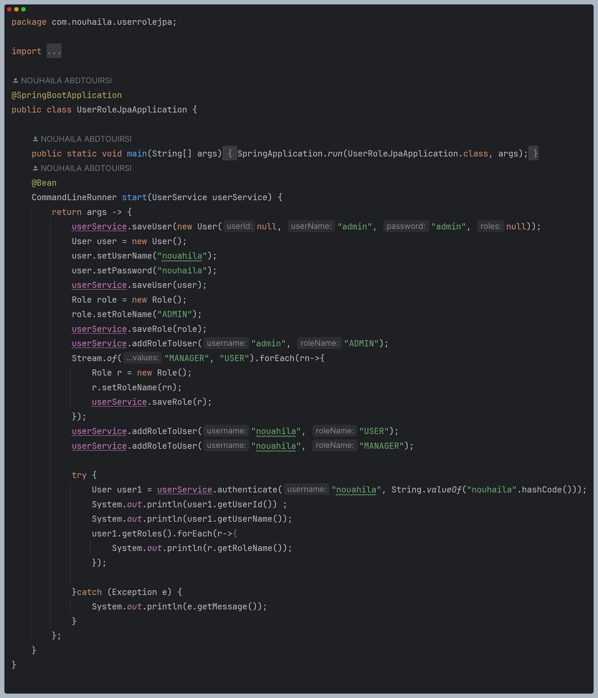

# Manage User Role Using ORM JPA HIbernate SpringData
<h2>Structure de projet : </h2>

## Objectif
### Pre-requis :
1. Installer IntelliJ Ultimate
2. Créer un projet Spring Initializer avec les dépendances JPA, H2, Spring Web et Lombock
## Etapes :
1. Créer les entités JPA :
    - User ayant les attributs :
        - userId de type String
        - userName de type String
        - password de type String
        - role de type List<Role>
          
    - Patient ayant les attributs :
        - roleId de type Long
        - desc de type String
        - roleName de type String
        - users de type List<User> 
          
2. Configurer l'unité de persistance dans le ficher application.properties
   

3. Créer les interfaces JPA Repository basée sur Spring data
   - UserRepository :
     

   - RoleRepository :
     
4. Creer les services permettant de separer la logique metier 
    - UserService Interface :
      
    
    - UserServiceImpl :
      
5. Tester quelques opérations de gestion de patients :
    - Ajouter un utilisateur  
    - Ajouter des roles  
    - Ajouter un role a un utilisateur  
    - Authentifier un utilisateur et afficher ses infos 
      
